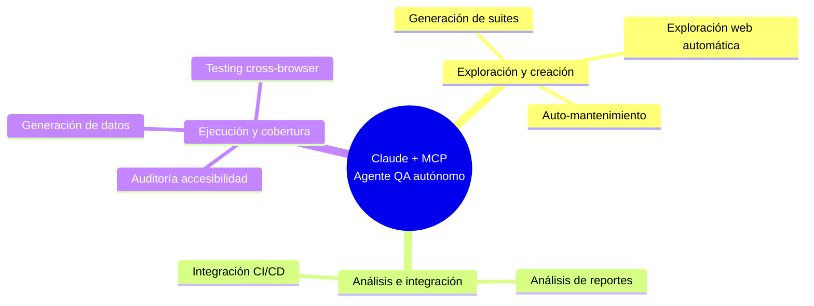

# MCP para Testing Automatizado

> Investigación en curso sobre el Model Context Protocol (MCP) aplicado a QA y pruebas automatizadas — web y móvil.

## 📌 ¿Qué es esto?

Este repositorio recopila investigación, notas, enlaces y prompts sobre cómo usar **MCP + Claude** para automatizar tareas de testing: exploración web, generación de suites, mantenimiento de tests, análisis de reportes, pruebas móviles, y más.

---

## 🗺️ Ruta de aprendizaje guiada

Si es la primera vez que llegas a este repo, **no lo leas de arriba hacia abajo** — sigue este orden. Cada fase da por hecho que ya completaste la anterior.

> 📌 **Prerequisito:** se asume que ya sabes lo básico de testing automatizado tradicional (Selenium/Cypress/Playwright/Appium). MCP no reemplaza ese conocimiento, se apoya en él.

### Fase 0 — Fundamentos conceptuales (nunca te saltes esto)

1. [¿Qué es MCP? (analogía)](./docs/web/que-es-mcp-analogia.md) — el punto de entrada obligatorio si nunca usaste MCP.
2. [Mapa de capacidades de Claude + MCP en QA](./docs/web/capacidades-mcp-qa.md) — panorama completo de las 8 capacidades, para saber qué es posible antes de instalar nada.
3. 🔒 [Seguridad al usar Claude + MCP](./docs/web/seguridad-mcp-qa.md) — léela **antes** de conectar MCP a cualquier proyecto real, no después de tener un problema.
4. 📋 [Limitaciones reales de Claude + MCP](./docs/web/limitaciones-reales-mcp.md) — catálogo vivo de limitaciones vividas en la práctica (empieza con la falta de contexto persistente entre sesiones y cómo resolverla con `CLAUDE.md`), para calibrar expectativas antes de empezar.

### Fase 1 — Instalación

1. [Instalación rápida](#-instalación-rápida-empieza-aquí) — la sección de este mismo README, con los comandos mínimos para arrancar.
2. [Guía completa (Serenity BDD + IntelliJ)](./docs/web/guia-mcp-qa-serenity.md) — la versión extendida, con prompts de diagnóstico inicial del proyecto.

### Fase 2 — Testing Web con MCP

1. [Playwright MCP vs Screenplay Pattern](./docs/web/testing-playwright-mcp-vs-screenplay.md) — entiende primero **cuándo** conviene este enfoque frente a la automatización tradicional, antes de lanzarte a usarlo en todo.
2. [Prompts reutilizables](./recursos/prompts/web/prompts-mcp.md) 🎯 — la librería de prompts ya probados, organizados por capacidad.
3. Troubleshooting real, consúltalos cuando te aparezca el mismo problema:
   - [Rutas con espacios en Windows](./docs/web/troubleshooting-mcp-filesystem-windows.md)
   - [Cambiar de proyecto (reconfigurar filesystem)](./docs/web/mcp-filesystem-entre-proyectos.md)
4. 🏁 **Práctica integradora:** [Caso de estudio real (7 días → 3 días)](./docs/web/caso-estudio-suite-e2e-mcp.md) — la evidencia completa de qué esperar en un proyecto real, incluyendo la limitación más importante a tener en cuenta.

### Fase 3 — Testing Móvil con MCP (Android)

1. [Instalación del entorno Android](./docs/movil/instalacion-entorno-android.md) — Node, JDK, Android Studio, Appium, cliente MCP.
2. [Claude Code vs Claude Desktop](./docs/movil/decision-claude-desktop-vs-code.md) — por qué se eligió Claude Code, para no repetir la misma investigación.
3. [Conectar appium-mcp a Claude Code](./docs/movil/paso3-conectar-appium-claude-code.md) — el paso vigente.
4. [Appium Inspector vs capabilities.json](./docs/movil/appium-inspector-vs-capabilities-json.md) — aclaración importante antes de armar tu primera sesión.
5. Troubleshooting: [appium-mcp aparece como "failed"](./docs/movil/troubleshooting-appium-mcp-failed.md)

> ⚠️ [Conectar appium-mcp a Claude Desktop](./docs/movil/paso3-conectar-appium-claude-desktop.md) es una alternativa **no usada** — se documentó por completitud, no es el camino recomendado.

### Fase 4 — Capacidades por validar (🟡 conceptuales, sin ejecutar todavía)

Estas seis notas describen ideas con buen potencial, pero **todavía no probadas en un proyecto real** como sí lo está el caso de estudio de la Fase 2. Si las pones en práctica, avísate a ti mismo para actualizar el indicador a 🟢 y documentar lo que encontraste (bueno o malo):

- [Auditoría de accesibilidad](./docs/web/auditoria-accesibilidad.md)
- [Auto-mantenimiento de tests rotos](./docs/web/auto-mantenimiento-flujo.md)
- [Testing cross-browser](./docs/web/testing-crossbrowser.md)
- [Estrategia de generación de suites](./docs/web/generacion-suites-estrategia.md)
- [Análisis de reportes](./docs/web/analisis-reportes-serenity.md)
- [Generación de datos de prueba](./docs/web/generacion-datos-prueba.md)

---

## 🚀 Instalación rápida (empieza aquí)

> Configuración probada en Windows con IntelliJ IDEA + Serenity BDD.

### Requisitos previos

- IntelliJ IDEA (cualquier edición)
- Node.js — verifica con `node --version` ([descargar](https://nodejs.org))
- Java 17 o superior
- Un proyecto Serenity BDD existente

### 1 — Instalar Claude Code

```bash
npm install -g @anthropic-ai/claude-code
claude --version
```

### 2 — Plugin en IntelliJ

`Settings → Plugins → Marketplace` → buscar **"claude mcp"** → instalar **"MCP Servers for AI Assist..."** (by meanmail.dev) → reiniciar IntelliJ.

> También verás `Claude Code [Beta]` en `Settings → Tools` — es la integración oficial de Anthropic, se configura automáticamente.

### 3 — Agregar servidor filesystem

```bash
claude mcp add filesystem npx -- -y @modelcontextprotocol/server-filesystem "C:\ruta\a\tu\proyecto"
```

> **Windows:** Si la ruta tiene espacios, ponla siempre entre comillas dobles.

### 4 — Agregar servidor Playwright

```bash
claude mcp add playwright npx -- -y @playwright/mcp@latest
```

### 5 — Verificar

```bash
claude mcp list
```

Resultado esperado:

```
filesystem: npx -y @modelcontextprotocol/server-filesystem C:\...\ProyectoWebQA - √ Connected
playwright: npx -y @playwright/mcp@latest - √ Connected
```

### Referencia rápida de comandos

| Acción | Comando |
|--------|---------|
| Agregar filesystem | `claude mcp add filesystem npx -- -y @modelcontextprotocol/server-filesystem "C:\ruta"` |
| Agregar Playwright | `claude mcp add playwright npx -- -y @playwright/mcp@latest` |
| Ver servidores | `claude mcp list` |
| Eliminar servidor | `claude mcp remove [nombre]` |
| Abrir Claude Code | `claude` |
| Ver versión | `claude --version` |

📖 **¿Quieres la guía completa y detallada?** — [`docs/web/guia-mcp-qa-serenity.md`](./docs/web/guia-mcp-qa-serenity.md) tiene el paso a paso extendido (agregar/eliminar servidores adicionales, prompts de diagnóstico inicial del proyecto, prompts de exploración y generación automática de tests) más allá de lo resumido arriba.

---

## 🌐 Testing Web

### Mapa de capacidades



### Documentación

| Documento | Contenido |
|---|---|
| [`docs/web/que-es-mcp-analogia.md`](./docs/web/que-es-mcp-analogia.md) | 👉 Empieza aquí si eres nuevo en MCP |
| [`docs/web/caso-estudio-suite-e2e-mcp.md`](./docs/web/caso-estudio-suite-e2e-mcp.md) | 🟢 **Caso real (7 días → 3 días):** 42 pruebas E2E generadas con Claude+MCP en un proyecto de gestión comercial (Serenity/Screenplay) — metodología de exploración incremental, problemas técnicos resueltos, y la limitación clave detectada (Claude puede "creer" que un clic funcionó a nivel de código sin que el resultado sea visible en pantalla) |
| [`docs/web/seguridad-mcp-qa.md`](./docs/web/seguridad-mcp-qa.md) | 🔒 **Léela antes de conectar MCP a un proyecto real:** credenciales, alcance del servidor `filesystem`, por qué nunca apuntar a producción, cuentas de prueba, qué "ve" realmente Claude durante una sesión, y checklist rápido previo a cada conexión |
| [`docs/web/limitaciones-reales-mcp.md`](./docs/web/limitaciones-reales-mcp.md) | 📋 **Catálogo vivo:** falta de contexto persistente entre sesiones (con plantilla de `CLAUDE.md` lista para usar), reproducibilidad y consumo de tokens (pendientes de documentar), y link a la limitación ya cubierta en el caso de estudio |
| [`docs/web/capacidades-mcp-qa.md`](./docs/web/capacidades-mcp-qa.md) | Resumen de las 8 capacidades de Claude + MCP en QA |
| [`docs/web/auditoria-accesibilidad.md`](./docs/web/auditoria-accesibilidad.md) | 🟡 Conceptual — Auditoría a11y automática con Playwright |
| [`docs/web/auto-mantenimiento-flujo.md`](./docs/web/auto-mantenimiento-flujo.md) | 🟡 Conceptual — Cómo se detectan y reparan tests rotos |
| [`docs/web/testing-crossbrowser.md`](./docs/web/testing-crossbrowser.md) | 🟡 Conceptual — Ejecución en Chrome, Firefox y Safari en paralelo |
| [`docs/web/generacion-suites-estrategia.md`](./docs/web/generacion-suites-estrategia.md) | 🟡 Conceptual — Estrategia de 3 niveles: smoke, regresión core, completa |
| [`docs/web/analisis-reportes-serenity.md`](./docs/web/analisis-reportes-serenity.md) | 🟡 Conceptual — Análisis de patrones de fallo y cobertura |
| [`docs/web/generacion-datos-prueba.md`](./docs/web/generacion-datos-prueba.md) | 🟡 Conceptual — Generación de datos de prueba realistas |
| [`docs/web/testing-playwright-mcp-vs-screenplay.md`](./docs/web/testing-playwright-mcp-vs-screenplay.md) | Playwright MCP (agente IA + `.md`) vs Screenplay Pattern + Cucumber + JUnit: estructura de un proyecto MCP, chat directo vs archivos versionados, comparación con automatización tradicional, y cómo combinar ambos (MCP como exploración, Screenplay como código final en CI/CD) |
| [`docs/web/troubleshooting-mcp-filesystem-windows.md`](./docs/web/troubleshooting-mcp-filesystem-windows.md) | 🟢 Error real resuelto: rutas con espacios en Windows |
| [`docs/web/mcp-filesystem-entre-proyectos.md`](./docs/web/mcp-filesystem-entre-proyectos.md) | 🟢 Cómo cambiar la ruta de MCP al pasar de un proyecto a otro |

> 🟢 = validado con experiencia real · 🟡 = conceptual, pendiente de ejecutarse en un proyecto real · 🔒 = guía de seguridad, léela antes de conectar MCP a un proyecto · sin marca = análisis/comparativa

**Prompts:** [`recursos/prompts/web/prompts-mcp.md`](./recursos/prompts/web/prompts-mcp.md) 🎯
**Enlaces curados:** [`recursos/enlaces/mcp-testing.md`](./recursos/enlaces/mcp-testing.md) *(plantilla en construcción, se irá llenando)*

---

## 📱 Testing Móvil

> En investigación activa — Android + Windows por ahora.

### Documentación

| Documento | Contenido |
|---|---|
| [`docs/movil/instalacion-entorno-android.md`](./docs/movil/instalacion-entorno-android.md) | 👉 Empieza aquí: instalación completa del entorno (Node, JDK, Android Studio, Appium, cliente MCP) |
| [`docs/movil/decision-claude-desktop-vs-code.md`](./docs/movil/decision-claude-desktop-vs-code.md) | Decisión: por qué se usa Claude Code y no Claude Desktop |
| [`docs/movil/paso3-conectar-appium-claude-code.md`](./docs/movil/paso3-conectar-appium-claude-code.md) | ✅ Paso 3 vigente: conectar appium-mcp a Claude Code |
| ↳ [`docs/movil/appium-inspector-vs-capabilities-json.md`](./docs/movil/appium-inspector-vs-capabilities-json.md) | Aclaración: por qué no se reutiliza el capabilities de Inspector directamente |
| ↳ [`docs/movil/troubleshooting-appium-mcp-failed.md`](./docs/movil/troubleshooting-appium-mcp-failed.md) | Error real resuelto: appium-mcp aparece como "failed" |
| ↳ [`docs/movil/paso3-conectar-appium-claude-desktop.md`](./docs/movil/paso3-conectar-appium-claude-desktop.md) | ⚠️ Versión alternativa no usada (Claude Desktop) |

**Prompts:** [`recursos/prompts/movil/`](./recursos/prompts/movil) *(aún vacío, se irá llenando)*

---

## 🛠️ Solución de problemas comunes

### `filesystem: × Failed to connect`
Rutas con espacios en Windows. Solución:
```bash
claude mcp remove filesystem
claude mcp add filesystem npx -- -y @modelcontextprotocol/server-filesystem "C:\ruta\sin espacios"
```

### `MCP server filesystem already exists`
El servidor ya está registrado con otra ruta. Elimínalo primero:
```bash
claude mcp remove filesystem
claude mcp add filesystem npx -- -y @modelcontextprotocol/server-filesystem "C:\nueva\ruta"
```

### Claude dice "no tengo herramienta de navegador"
Falta el servidor de Playwright. Agrégalo y abre una sesión nueva:
```bash
claude mcp add playwright npx -- -y @playwright/mcp@latest
```

### `Needs authentication` en Gmail, Drive o Calendar
Son servidores opcionales de Google, no necesarios para QA. Para autenticarlos, ejecuta `claude` en terminal e intenta usar uno de esos servicios.

---

## 📂 Estructura del repositorio

```
mcp-testing-research/
├── docs/
│   ├── web/       ← documentación de MCP para testing web
│   └── movil/     ← documentación de MCP para testing móvil
├── notas/         ← notas de investigación en bruto, ideas sueltas
├── recursos/
│   ├── enlaces/       ← enlaces externos curados, por categoría
│   ├── prompts/
│   │   ├── web/       ← prompts reutilizables para testing web
│   │   └── movil/     ← prompts reutilizables para testing móvil
│   └── capturas/      ← capturas de pantalla relevantes (diagramas, UI)
└── ejemplos/      ← código o configuraciones de ejemplo
```

## 🚧 Estado

Proyecto en investigación activa. Ver [`notas/`](./notas) para el progreso más reciente.

> 📝 Para agregar una nota nueva, copia [`notas/_plantilla.md`](./notas/_plantilla.md) como punto de partida (contexto, hallazgos, preguntas abiertas, fuentes).

## 📄 Licencia

Este contenido se comparte bajo [MIT License](./LICENSE) (o cambia según prefieras: CC-BY para contenido no-código).
