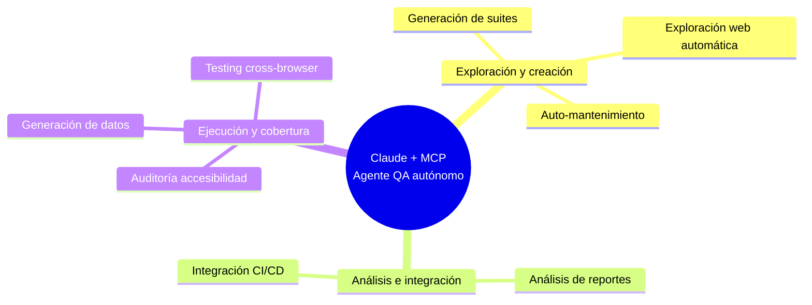

# MCP para Testing Automatizado

> Investigación en curso sobre el Model Context Protocol (MCP) aplicado a QA y pruebas automatizadas.

## 📌 ¿Qué es esto?

Este repositorio recopila investigación, notas, enlaces y ejemplos sobre cómo usar **MCP + Claude** para automatizar tareas de testing: exploración web, generación de suites, mantenimiento de tests, análisis de reportes, y más.

## 🗺️ Mapa de capacidades

## 📂 Estructura del repositorio

| Carpeta | Qué contiene |
|---|---|
| [`docs/`](./docs) | Documentación pulida y organizada por tema |
| [`notas/`](./notas) | Notas de investigación en bruto, ideas sueltas |
| [`recursos/enlaces/`](./recursos/enlaces) | Enlaces externos curados, por categoría |
| [`recursos/capturas/`](./recursos/capturas) | Capturas de pantalla relevantes (diagramas, UI) |
| [`ejemplos/`](./ejemplos) | Código o configuraciones de ejemplo |

## 🚧 Estado

Proyecto en investigación activa. Ver [`notas/`](./notas) para el progreso más reciente.

## 📄 Licencia

Este contenido se comparte bajo [MIT License](./LICENSE) (o cambia según prefieras: CC-BY para contenido no-código).
