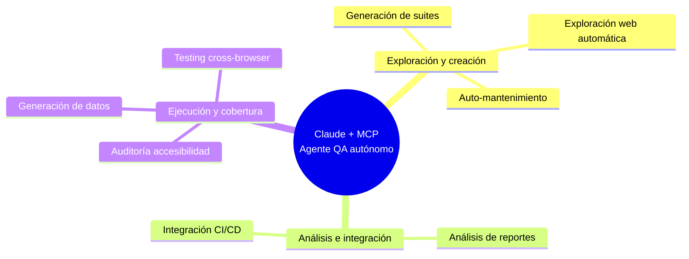

# MCP para Testing Automatizado

> Investigación en curso sobre el Model Context Protocol (MCP) aplicado a QA y pruebas automatizadas — web y móvil.

## 📌 ¿Qué es esto?

Este repositorio recopila investigación, notas, enlaces y prompts sobre cómo usar **MCP + Claude** para automatizar tareas de testing: exploración web, generación de suites, mantenimiento de tests, análisis de reportes, pruebas móviles, y más.

## 🌐 Testing Web

### Mapa de capacidades



### Documentación

| Documento | Contenido |
|---|---|
| [`docs/web/que-es-mcp-analogia.md`](./docs/web/que-es-mcp-analogia.md) | 👉 Empieza aquí si eres nuevo en MCP |
| [`docs/web/capacidades-mcp-qa.md`](./docs/web/capacidades-mcp-qa.md) | Resumen de las 8 capacidades de Claude + MCP en QA |
| [`docs/web/auditoria-accesibilidad.md`](./docs/web/auditoria-accesibilidad.md) | Auditoría a11y automática con Playwright |
| [`docs/web/auto-mantenimiento-flujo.md`](./docs/web/auto-mantenimiento-flujo.md) | Cómo se detectan y reparan tests rotos |
| [`docs/web/testing-crossbrowser.md`](./docs/web/testing-crossbrowser.md) | Ejecución en Chrome, Firefox y Safari en paralelo |
| [`docs/web/generacion-suites-estrategia.md`](./docs/web/generacion-suites-estrategia.md) | Estrategia de 3 niveles: smoke, regresión core, completa |
| [`docs/web/analisis-reportes-serenity.md`](./docs/web/analisis-reportes-serenity.md) | Análisis de patrones de fallo y cobertura |
| [`docs/web/generacion-datos-prueba.md`](./docs/web/generacion-datos-prueba.md) | Generación de datos de prueba realistas |
| [`docs/web/troubleshooting-mcp-filesystem-windows.md`](./docs/web/troubleshooting-mcp-filesystem-windows.md) | Error real resuelto: rutas con espacios en Windows |
| [`docs/web/mcp-filesystem-entre-proyectos.md`](./docs/web/mcp-filesystem-entre-proyectos.md) | Cómo cambiar la ruta de MCP al pasar de un proyecto a otro |

**Prompts:** [`recursos/prompts/web/prompts-mcp.md`](./recursos/prompts/web/prompts-mcp.md) 🎯

---

## 📱 Testing Móvil

> En investigación activa — Android + Windows por ahora.

### Documentación

| Documento | Contenido |
|---|---|
| [`docs/movil/instalacion-entorno-android.md`](./docs/movil/instalacion-entorno-android.md) | 👉 Empieza aquí: instalación completa del entorno (Node, JDK, Android Studio, Appium, cliente MCP) |
| [`docs/movil/decision-claude-desktop-vs-code.md`](./docs/movil/decision-claude-desktop-vs-code.md) | Decisión: por qué se usa Claude Code y no Claude Desktop |
| [`docs/movil/paso3-conectar-appium-claude-code.md`](./docs/movil/paso3-conectar-appium-claude-code.md) | ✅ Paso 3 vigente: conectar appium-mcp a Claude Code |
| ↳ [`docs/movil/paso3-conectar-appium-claude-desktop.md`](./docs/movil/paso3-conectar-appium-claude-desktop.md) | ⚠️ Versión alternativa no usada (Claude Desktop) |

**Prompts:** [`recursos/prompts/movil/`](./recursos/prompts/movil) *(aún vacío, se irá llenando)*

---

## 📂 Estructura del repositorio

```
mcp-testing-research/
├── docs/
│   ├── web/       ← documentación de MCP para testing web
│   └── movil/     ← documentación de MCP para testing móvil
├── notas/         ← notas de investigación en bruto, ideas sueltas
├── recursos/
│   ├── enlaces/       ← enlaces externos curados, por categoría
│   ├── prompts/
│   │   ├── web/       ← prompts reutilizables para testing web
│   │   └── movil/     ← prompts reutilizables para testing móvil
│   └── capturas/      ← capturas de pantalla relevantes (diagramas, UI)
└── ejemplos/      ← código o configuraciones de ejemplo
```

## 🚧 Estado

Proyecto en investigación activa. Ver [`notas/`](./notas) para el progreso más reciente.

## 📄 Licencia

Este contenido se comparte bajo [MIT License](./LICENSE) (o cambia según prefieras: CC-BY para contenido no-código).
