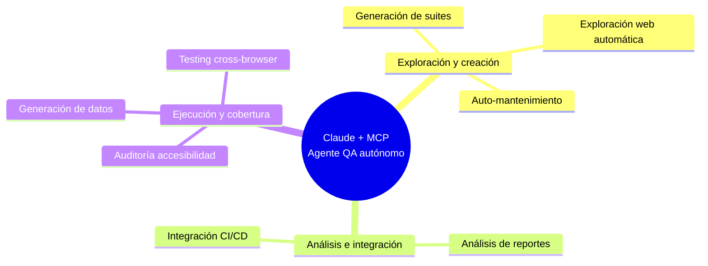

# MCP para Testing Automatizado

> Investigación en curso sobre el Model Context Protocol (MCP) aplicado a QA y pruebas automatizadas.

## 📌 ¿Qué es esto?

Este repositorio recopila investigación, notas, enlaces y ejemplos sobre cómo usar **MCP + Claude** para automatizar tareas de testing: exploración web, generación de suites, mantenimiento de tests, análisis de reportes, y más.

## 🗺️ Mapa de capacidades

## 📂 Estructura del repositorio

| Carpeta | Qué contiene |
|---|---|
| [`docs/`](./docs) | Documentación pulida y organizada por tema |
| ↳ [`docs/que-es-mcp-analogia.md`](./docs/que-es-mcp-analogia.md) | 👉 Empieza aquí si eres nuevo en MCP |
| ↳ [`docs/capacidades-mcp-qa.md`](./docs/capacidades-mcp-qa.md) | Resumen de las 8 capacidades de Claude + MCP en QA |
| ↳ [`docs/auditoria-accesibilidad.md`](./docs/auditoria-accesibilidad.md) | Auditoría a11y automática con Playwright |
| ↳ [`docs/auto-mantenimiento-flujo.md`](./docs/auto-mantenimiento-flujo.md) | Cómo se detectan y reparan tests rotos |
| ↳ [`docs/testing-crossbrowser.md`](./docs/testing-crossbrowser.md) | Ejecución en Chrome, Firefox y Safari en paralelo |
| ↳ [`docs/generacion-suites-estrategia.md`](./docs/generacion-suites-estrategia.md) | Estrategia de 3 niveles: smoke, regresión core, completa |
| ↳ [`docs/analisis-reportes-serenity.md`](./docs/analisis-reportes-serenity.md) | Análisis de patrones de fallo y cobertura |
| ↳ [`docs/generacion-datos-prueba.md`](./docs/generacion-datos-prueba.md) | Generación de datos de prueba realistas |
| ↳ [`docs/troubleshooting-mcp-filesystem-windows.md`](./docs/troubleshooting-mcp-filesystem-windows.md) | Error real resuelto: rutas con espacios en Windows |
| ↳ [`docs/mcp-filesystem-entre-proyectos.md`](./docs/mcp-filesystem-entre-proyectos.md) | Cómo cambiar la ruta de MCP al pasar de un proyecto a otro |
| [`notas/`](./notas) | Notas de investigación en bruto, ideas sueltas |
| [`recursos/enlaces/`](./recursos/enlaces) | Enlaces externos curados, por categoría |
| [`recursos/prompts/prompts-mcp.md`](./recursos/prompts/prompts-mcp.md) | 🎯 Prompts reutilizables, organizados por capacidad |
| [`recursos/capturas/`](./recursos/capturas) | Capturas de pantalla relevantes (diagramas, UI) |
| [`ejemplos/`](./ejemplos) | Código o configuraciones de ejemplo |

## 🚧 Estado

Proyecto en investigación activa. Ver [`notas/`](./notas) para el progreso más reciente.

## 📄 Licencia

Este contenido se comparte bajo [MIT License](./LICENSE) (o cambia según prefieras: CC-BY para contenido no-código).
