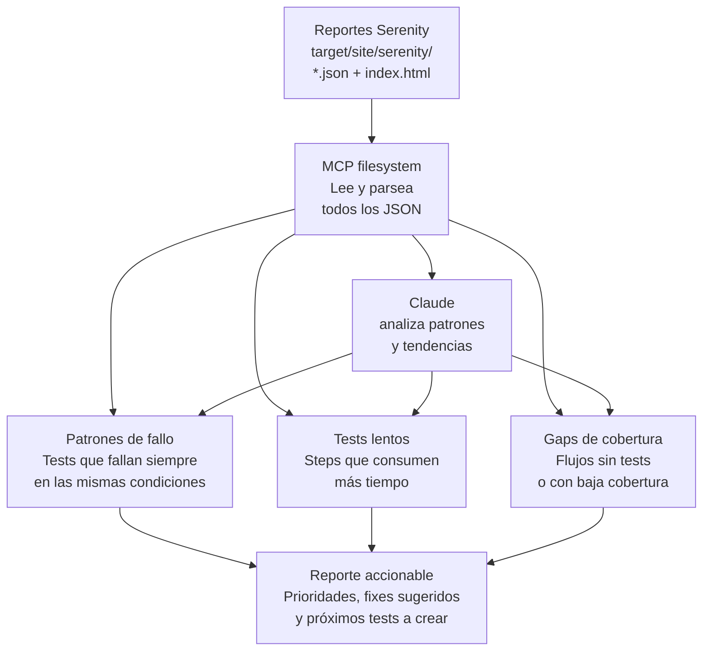

# Análisis de reportes Serenity con MCP

## Flujo

## Cómo funciona

1. Se parte de los **reportes Serenity** ya generados (`target/site/serenity/*.json` + `index.html`).
2. **MCP filesystem** lee y parsea todos los archivos JSON de resultados, sin tener que abrirlos manualmente uno por uno.
3. **Claude analiza** esos datos en busca de patrones y tendencias, en tres frentes:
   - **Patrones de fallo**: tests que fallan siempre bajo las mismas condiciones (indicio de un bug real, no un test "flaky")
   - **Tests lentos**: identificar qué steps consumen más tiempo de ejecución
   - **Gaps de cobertura**: flujos de la aplicación que no tienen tests, o que tienen baja cobertura
4. Todo esto se consolida en un **reporte accionable**: con prioridades, sugerencias de fix, y una lista de próximos tests a crear.

## Por qué importa
Los reportes de ejecución acumulan mucha información que normalmente nadie revisa a fondo por falta de tiempo. Automatizar este análisis convierte datos crudos de ejecución en decisiones concretas: qué arreglar primero, dónde falta cobertura.
