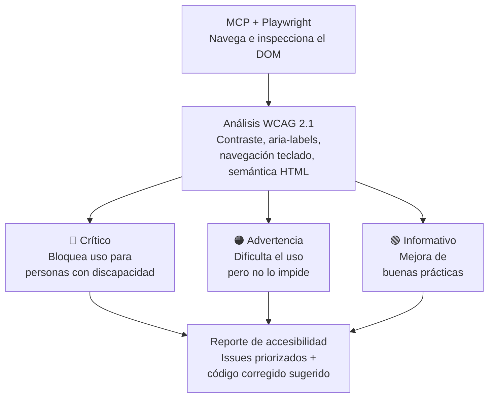

# Auditoría de accesibilidad con MCP + Playwright

## Flujo

## Cómo funciona

1. **MCP + Playwright** navega la aplicación web e inspecciona el DOM en vivo, sin necesidad de screenshots manuales.
2. Se analiza contra **WCAG 2.1**: contraste de color, etiquetas `aria-label`, navegación por teclado, y semántica HTML correcta.
3. Cada hallazgo se clasifica en 3 niveles de severidad:
   - **Crítico**: bloquea el uso para personas con discapacidad (ej. un botón sin texto accesible que un lector de pantalla no puede anunciar)
   - **Advertencia**: dificulta el uso pero no lo impide (ej. contraste de color por debajo del recomendado)
   - **Informativo**: mejora de buenas prácticas, no bloqueante
4. Se genera un **reporte de accesibilidad** con los issues priorizados y, cuando es posible, una sugerencia de código corregido.

## Por qué importa
La accesibilidad automatizada permite detectar estos problemas en cada ejecución de CI, en vez de descubrirlos manualmente o —peor— que los descubra un usuario real con una discapacidad.
