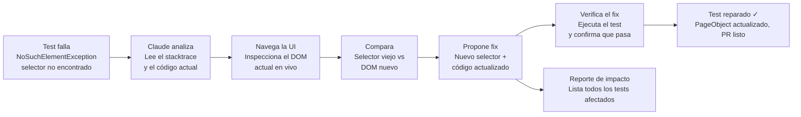

# Auto-mantenimiento de tests rotos

## Flujo

## Cómo funciona

1. **El test falla** con un error típico de automatización: `NoSuchElementException` — el selector que el test esperaba ya no existe en la página.
2. **Claude analiza** el stacktrace del error junto con el código del test actual, para entender qué se esperaba encontrar.
3. **Navega la UI en vivo** e inspecciona el DOM real, para ver cómo cambió la estructura de la página.
4. **Compara** el selector viejo (el que dejó de funcionar) contra el DOM nuevo, para identificar qué cambió.
5. **Propone un fix**: un nuevo selector y el código actualizado del test o del Page Object.
6. **Verifica el fix** ejecutando el test de nuevo, para confirmar que ahora sí pasa.
7. Como resultado: un **test reparado** (con el PageObject actualizado, listo para un Pull Request) y un **reporte de impacto** que lista todos los demás tests que usaban ese mismo selector y que también podrían estar afectados.

## Por qué importa
Este es uno de los puntos de mayor fricción en QA automatizado tradicional: cada cambio de UI rompe selectores, y repararlos uno por uno consume mucho tiempo. Automatizar el diagnóstico y la propuesta de fix reduce ese trabajo manual repetitivo.
