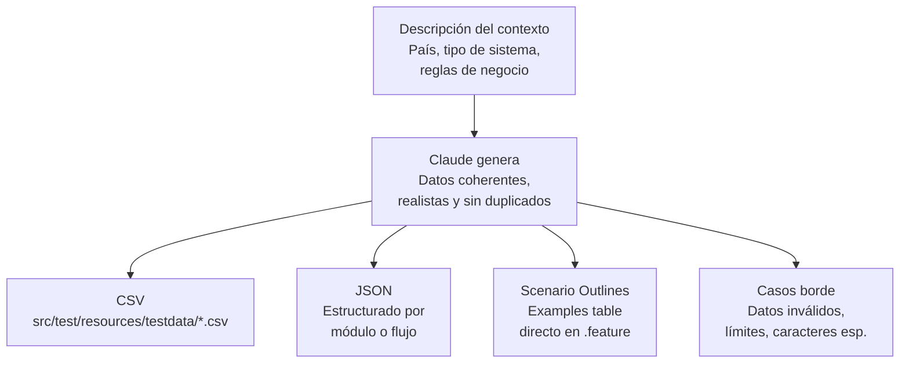

# Generación de datos de prueba con MCP

## Flujo

## Cómo funciona

1. Se parte de una **descripción del contexto**: país, tipo de sistema, reglas de negocio relevantes (ej. formato de cédula, reglas de validación de un formulario).
2. **Claude genera** datos de prueba coherentes, realistas y sin duplicados, en el formato que se necesite:
   - **CSV** — para cargarlo directo en `src/test/resources/testdata/*.csv`
   - **JSON** — estructurado por módulo o flujo, útil cuando los datos tienen relaciones anidadas
   - **Scenario Outlines** — tablas de `Examples` listas para pegar directo en un archivo `.feature` (Cucumber/Gherkin)
   - **Casos borde** — datos inválidos, valores límite, caracteres especiales, pensados específicamente para pruebas negativas

## Por qué importa
Escribir datos de prueba realistas a mano es lento y propenso a errores (nombres repetidos, formatos inconsistentes, falta de casos borde). Generarlos con contexto claro del negocio da datos más útiles y variados, listos para usar en el formato exacto que necesita el framework de testing.
