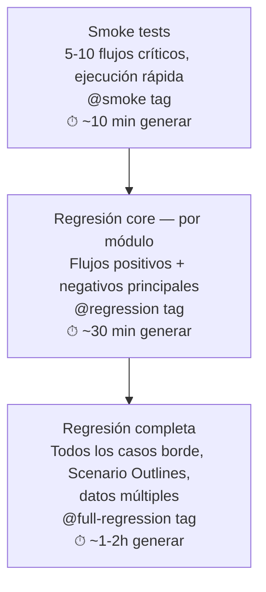

# Estrategia de generación de suites: 3 niveles

## Flujo

## Los 3 niveles

### 1. Smoke tests (`@smoke`)
- 5 a 10 flujos críticos, pensados para ejecución rápida
- Tiempo estimado de generación: ~10 minutos
- Objetivo: confirmar que lo esencial de la aplicación funciona, ideal para correr en cada commit

### 2. Regresión core — por módulo (`@regression`)
- Cubre flujos positivos y los negativos principales, organizados por módulo
- Tiempo estimado de generación: ~30 minutos
- Objetivo: cobertura sólida sin llegar a exhaustiva, para correr antes de cada release

### 3. Regresión completa (`@full-regression`)
- Incluye todos los casos borde, Scenario Outlines (múltiples variantes de datos), y combinaciones de datos múltiples
- Tiempo estimado de generación: ~1-2 horas
- Objetivo: cobertura exhaustiva, normalmente reservada para ejecución nocturna o antes de releases mayores

## Por qué importa
No toda ejecución necesita la misma profundidad de pruebas. Generar la suite en 3 niveles permite elegir el nivel de cobertura según el momento: rápido para cada commit, más completo antes de un release.
