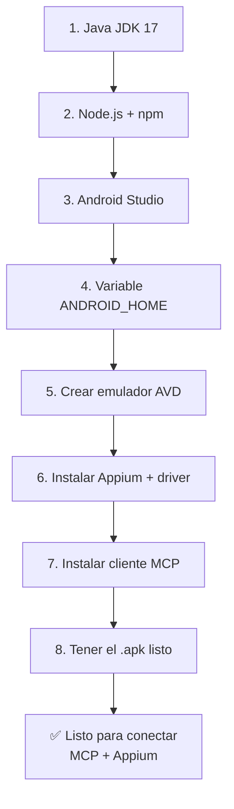

# Instalación del entorno: MCP para pruebas móviles (Android + Windows)

> Configuración: plataforma Android, sistema operativo Windows.

## Programas necesarios

### Base común (siempre se necesita)
| Programa | Para qué sirve |
|---|---|
| Node.js (LTS reciente) | Motor para correr Appium y los servidores MCP (se ejecutan con `npx`) |
| npm | Gestor de paquetes (viene incluido con Node.js) |
| Appium Server | Motor de automatización que controla el dispositivo/emulador |
| Un cliente MCP | Claude Desktop, Cursor, o VS Code con extensión MCP — donde se interactúa con el agente |
| Editor de código | VS Code, WebStorm, IntelliJ, etc. |
| Git | Para clonar repos de servidores MCP si es necesario |

### Solo para Android
| Programa | Para qué sirve |
|---|---|
| Android Studio | Trae el SDK, el emulador y herramientas de depuración (`adb`) |
| Android SDK + variable `ANDROID_HOME` | SDK de desarrollo Android |
| Java JDK (versión 17 recomendada) | Requerido por el SDK de Android y por Appium (driver UiAutomator2) |
| Driver `appium-uiautomator2-driver` | Driver de Appium para Android |

### Servidor MCP
- Servidor MCP de Appium (ej. `appium-mcp`, `@gavrix/appium-mcp`) — puente entre el asistente de IA y Appium

### Tu app a probar
- Archivo `.apk` de la app, o el package name si ya está instalada en el emulador/dispositivo

## Instalación paso a paso



### 1. Instalar Java JDK
1. Descargar el JDK 17 desde [adoptium.net](https://adoptium.net/)
2. Instalar con las opciones por defecto
3. Verificar en terminal (CMD o PowerShell):
   ```
   java -version
   ```
4. Configurar variable de entorno `JAVA_HOME`:
   - Buscar "Variables de entorno" en el menú de Windows
   - En "Variables del sistema" crear: `JAVA_HOME` = ruta del JDK (ej. `C:\Program Files\Eclipse Adoptium\jdk-17.x.x`)
   - Editar la variable `Path` y agregar: `%JAVA_HOME%\bin`

### 2. Instalar Node.js
1. Descargar la versión LTS desde [nodejs.org](https://nodejs.org/)
2. Instalar con opciones por defecto (incluye npm)
3. Verificar:
   ```
   node -v
   npm -v
   ```

### 3. Instalar Android Studio
1. Descargar desde [developer.android.com/studio](https://developer.android.com/studio)
2. Durante la instalación, marcar:
   - Android SDK
   - Android SDK Platform
   - Android Virtual Device (para el emulador)
3. Abrir Android Studio → **More Actions** → **SDK Manager** y confirmar que haya al menos una plataforma instalada (ej. Android 13 o 14)

### 4. Configurar variable ANDROID_HOME
1. Ubicar la ruta del SDK (normalmente `C:\Users\TU_USUARIO\AppData\Local\Android\Sdk`). Se puede ver en Android Studio → SDK Manager, arriba dice "Android SDK Location"
2. En "Variables de entorno" crear: `ANDROID_HOME` = esa ruta
3. Editar `Path` y agregar:
   ```
   %ANDROID_HOME%\platform-tools
   %ANDROID_HOME%\emulator
   ```
4. Verificar en una terminal **nueva**:
   ```
   adb version
   ```

### 5. Crear un emulador (Android Virtual Device)
1. En Android Studio → **More Actions** → **Virtual Device Manager**
2. Crear un dispositivo (ej. Pixel 6) con una imagen de sistema (ej. Android 13)
3. Iniciarlo una vez para comprobar que arranca correctamente

### 6. Instalar Appium
En terminal:
```
npm install -g appium
appium driver install uiautomator2
```
Verificar:
```
appium -v
```

### 7. Instalar un cliente MCP
Opciones más comunes:
- Claude Desktop (recomendado si se va a usar Claude)
- Cursor
- VS Code con extensión MCP

Descargar e instalar el que se elija.

### 8. Tener la app lista
Se necesita el archivo `.apk` de la app a probar, o el package name si ya está instalada en el emulador/dispositivo.

## ✅ Checklist antes de continuar

- [ ] `java -version` funciona
- [ ] `node -v` y `npm -v` funcionan
- [ ] `adb version` funciona
- [ ] Emulador Android creado y probado
- [ ] `appium -v` funciona
- [ ] Cliente MCP elegido e instalado

## Próximo paso

Instalar y configurar el servidor MCP de Appium, conectarlo al cliente MCP elegido, y comenzar a explorar la app para generar los flujos de prueba en lenguaje natural.

> Este es el primero de una serie de pasos. Se irá documentando cada avance como una nota nueva en esta misma carpeta (`docs/movil/`).
