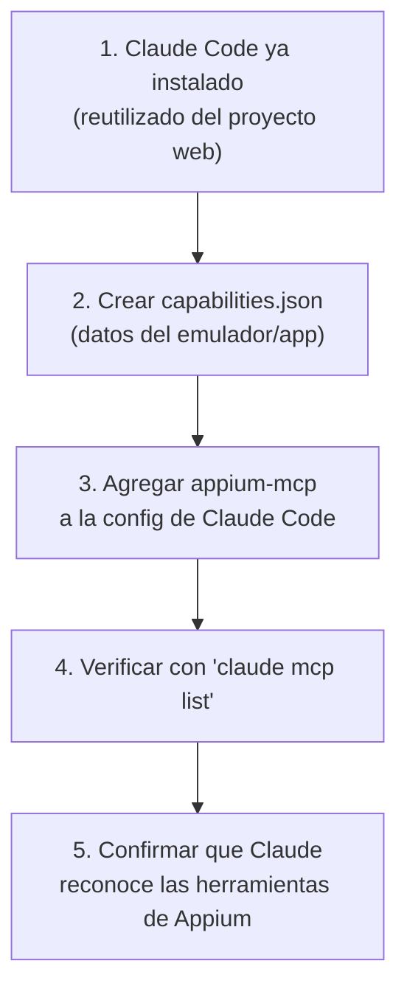

# Paso 3 (revisado): Conectar el servidor MCP de Appium a Claude Code

> ⚠️ Este documento reemplaza al Paso 3 original pensado para Claude Desktop.
> Ver la razón del cambio en: [Decisión: Claude Desktop vs Claude Code](./decision-claude-desktop-vs-code.md)
>
> Configuración: Android + Windows + **Claude Code** (el mismo plugin/CLI ya usado en el proyecto web con IntelliJ).

## Flujo general



## 3.1 — Punto de partida
No se instala nada nuevo: se reutiliza el mismo Claude Code que ya está funcionando en IntelliJ con el proyecto web (con el servidor de Playwright ya conectado).

## 3.2 — Crear el archivo de capacidades de Appium
Igual que en la versión anterior del tutorial, crear un archivo `capabilities.json` en una carpeta fácil de recordar (ej. `C:\mcp-mobile\capabilities.json`):

```json
{
  "android": {
    "platformName": "Android",
    "appium:platformVersion": "13",
    "appium:deviceName": "Android Emulator",
    "appium:app": "C:\\ruta\\a\\tu\\app.apk",
    "appium:automationName": "UiAutomator2"
  }
}
```

> **Nota:** Si la app ya está instalada en el emulador, se puede reemplazar `"appium:app"` por `"appium:appPackage"` y `"appium:appActivity"`.

> 💡 Si ya probaste estas capacidades en **Appium Inspector** y funcionaron, no puedes reutilizar esa configuración directamente — hay que crear este archivo `.json` a mano copiando el mismo contenido. Ver [Appium Inspector vs capabilities.json](./appium-inspector-vs-capabilities-json.md) para el detalle.

## 3.3 — Agregar el servidor appium-mcp a Claude Code

Hay dos formas de hacerlo — elige una:

### Opción 1 — Comando `claude mcp add` (más rápido)
Desde la terminal integrada de IntelliJ (o CMD, dentro de la carpeta del proyecto):

```
claude mcp add appium-mcp npx -- -y appium-mcp@latest
```

> Recuerda: si alguna ruta que uses tiene espacios, ponla entre comillas (ver [troubleshooting de rutas en Windows](../web/troubleshooting-mcp-filesystem-windows.md) — el mismo problema aplica aquí).

Las variables de entorno (`ANDROID_HOME`, `CAPABILITIES_CONFIG`) se agregan editando el archivo de configuración directamente (ver Opción 2), ya que el comando `claude mcp add` no siempre permite pasarlas todas en una sola línea.

### Opción 2 — Editar `.mcp.json` directamente
En la raíz del proyecto (o en `~/.claude.json` para configuración a nivel de usuario), agregar la entrada del servidor:

```json
{
  "mcpServers": {
    "appium-mcp": {
      "type": "stdio",
      "command": "npx",
      "args": ["-y", "appium-mcp@latest"],
      "env": {
        "ANDROID_HOME": "C:\\Users\\TU_USUARIO\\AppData\\Local\\Android\\Sdk",
        "CAPABILITIES_CONFIG": "C:\\mcp-mobile\\capabilities.json"
      }
    }
  }
}
```

Ajustar:
- `ANDROID_HOME` con la ruta real del SDK
- `CAPABILITIES_CONFIG` con la ruta donde se guardó `capabilities.json`

> Si el archivo `.mcp.json` ya tiene otros servidores configurados (ej. Playwright del proyecto web), **agregar** `appium-mcp` como una entrada más dentro de `mcpServers`, sin borrar los que ya existen.

## 3.4 — Verificar la conexión

```
claude mcp list
```

Debería aparecer algo como:
```
appium-mcp: npx -y appium-mcp@latest - ✓ Connected
```

## 3.5 — Confirmar que Claude reconoce las herramientas
1. Iniciar el emulador Android desde Android Studio (o con `emulator -avd NOMBRE_AVD` en terminal)
2. En una conversación con Claude Code, preguntar:
   ```
   ¿Tienes acceso a herramientas de Appium para automatización móvil?
   ```
3. Claude debería listar las herramientas disponibles (sesión, tap, swipe, screenshot, etc.)

## ✅ Checklist del paso 3 (Claude Code)

- [ ] `capabilities.json` creado con los datos correctos
- [ ] `appium-mcp` agregado a `.mcp.json` (o vía `claude mcp add`)
- [ ] `claude mcp list` muestra `appium-mcp` como `Connected`
- [ ] Emulador corriendo y Claude reconoce las herramientas de Appium
- [ ] El servidor de Playwright (del proyecto web) sigue apareciendo conectado también — sin conflicto entre ambos

## Próximo paso (Paso 4)

Crear la primera sesión de Appium desde Claude y comenzar a explorar la app para generar los flujos de prueba en lenguaje natural.

## Relacionado
- [Decisión: Claude Desktop vs Claude Code](./decision-claude-desktop-vs-code.md)
- [Paso 2 — Instalación del entorno completo](./instalacion-entorno-android.md)
- [Versión original con Claude Desktop (Opción A, no usada)](./paso3-conectar-appium-claude-desktop.md)
