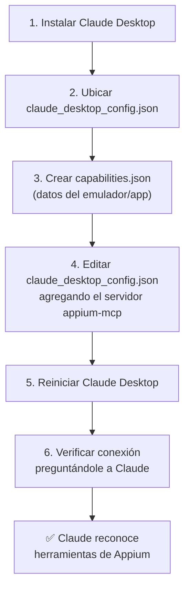

# Paso 3: Conectar el servidor MCP de Appium a Claude Desktop

> Configuración: Android + Windows + Claude Desktop como cliente MCP.

## Flujo general



## 3.1 — Instalar Claude Desktop
1. Descargar desde [claude.ai/download](https://claude.ai/download)
2. Instalar y abrir sesión con tu cuenta

## 3.2 — Ubicar el archivo de configuración de Claude Desktop
Claude Desktop usa un archivo `claude_desktop_config.json` para saber qué servidores MCP debe conectar.

En Windows, la ruta es:
```
%APPDATA%\Claude\claude_desktop_config.json
```

Para llegar ahí rápido:
1. Presionar `Win + R`
2. Escribir: `%APPDATA%\Claude`
3. Si el archivo `claude_desktop_config.json` no existe, crearlo con el Bloc de notas (guardarlo con extensión `.json`, no `.txt`)

## 3.3 — Crear el archivo de capacidades de Appium
Crear un archivo, por ejemplo `capabilities.json`, en una carpeta fácil de recordar (ej. `C:\mcp-mobile\capabilities.json`):

```json
{
  "android": {
    "platformName": "Android",
    "appium:platformVersion": "13",
    "appium:deviceName": "Android Emulator",
    "appium:app": "C:\\ruta\\a\\tu\\app.apk",
    "appium:automationName": "UiAutomator2"
  }
}
```

> **Nota:** Si la app ya está instalada en el emulador (no es necesario instalarla desde cero), se puede reemplazar `"appium:app"` por `"appium:appPackage"` y `"appium:appActivity"`.

## 3.4 — Configurar el servidor MCP en Claude Desktop
Editar `claude_desktop_config.json` con este contenido:

```json
{
  "mcpServers": {
    "appium-mcp": {
      "type": "stdio",
      "command": "npx",
      "args": ["appium-mcp@latest"],
      "env": {
        "ANDROID_HOME": "C:\\Users\\TU_USUARIO\\AppData\\Local\\Android\\Sdk",
        "CAPABILITIES_CONFIG": "C:\\mcp-mobile\\capabilities.json"
      }
    }
  }
}
```

Ajustar:
- `ANDROID_HOME` con la ruta real del SDK
- `CAPABILITIES_CONFIG` con la ruta donde se guardó `capabilities.json`

## 3.5 — Reiniciar Claude Desktop
1. Cerrar Claude Desktop completamente (verificar que no quede en la bandeja del sistema)
2. Abrirlo de nuevo
3. Ir a la configuración de Claude Desktop, sección de conectores/MCP, y confirmar que **"appium-mcp"** aparezca conectado (ícono verde o "Connected")

## 3.6 — Verificar la conexión
1. Antes que nada, iniciar el emulador Android desde Android Studio (o con `emulator -avd NOMBRE_AVD` en terminal)
2. En una conversación nueva de Claude Desktop, escribir:
   ```
   ¿Tienes acceso a herramientas de Appium para automatización móvil?
   ```
3. Claude debería listar las herramientas disponibles (sesión, tap, swipe, screenshot, etc.)

## ✅ Checklist del paso 3

- [ ] Claude Desktop instalado y con sesión iniciada
- [ ] `capabilities.json` creado con los datos correctos
- [ ] `claude_desktop_config.json` editado con el servidor `appium-mcp`
- [ ] Claude Desktop reiniciado y muestra el conector conectado
- [ ] Emulador corriendo y Claude reconoce las herramientas de Appium

## Próximo paso (Paso 4)

Crear la primera sesión de Appium desde Claude y comenzar a explorar la app para generar los flujos de prueba en lenguaje natural.

## Relacionado
- [Paso 2 — Instalación del entorno completo](./instalacion-entorno-android.md)
