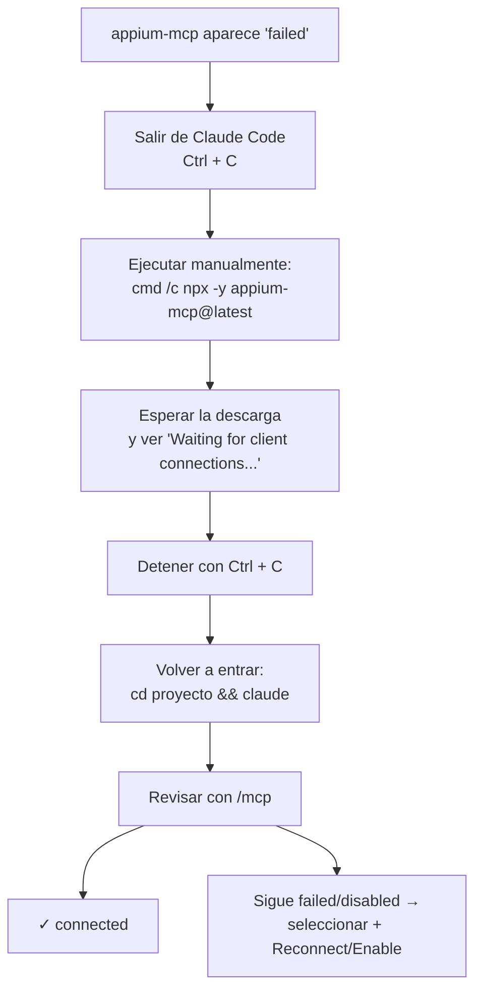

# Troubleshooting: appium-mcp aparece como "failed" en Claude Code

## El problema

Al agregar el servidor MCP de Appium (`appium-mcp`) a un proyecto de Claude Code, y luego abrir el menú de servidores con:
```
/mcp
```
el servidor aparece marcado así:
```
appium-mcp · ✗ failed
```
Claude Code no logra conectarse a él.

## Por qué pasa esto

El servidor `appium-mcp` no es un programa que ya esté instalado en la computadora: se descarga automáticamente desde internet la primera vez que se usa (esto se hace con `npx`, que "descarga y ejecuta" un paquete de software en un solo paso).

Esa primera descarga puede tardar varios segundos o incluso minutos, dependiendo de la velocidad de internet, porque trae consigo varias dependencias adicionales.

Claude Code, al conectarse a un servidor MCP, espera un tiempo limitado (un *timeout*). Si la descarga tarda más de lo que Claude Code está dispuesto a esperar, lo marca como `failed` — aunque en realidad el servidor solo estaba tardando en descargarse, no estaba roto.

**En resumen:** la primera vez puede fallar por lentitud en la descarga. Las siguientes veces, como el paquete ya quedó guardado en caché, arranca mucho más rápido y sin fallar.

## Cómo confirmar el diagnóstico y solucionarlo



### Paso 1 — Salir de la sesión de Claude Code
Si estás dentro de una sesión de Claude Code (la terminal muestra un cuadro de bienvenida y un símbolo `>`), sal con:
```
Ctrl + C
```
(puede que debas presionarlo dos veces)

### Paso 2 — Ejecutar el servidor manualmente, sin Claude Code
En la terminal normal:
```
cmd /c npx -y appium-mcp@latest
```
Esto ejecuta el mismo servidor que Claude Code intenta usar, pero de forma directa, para ver todos los mensajes que genera sin que se corten por timeout.

### Paso 3 — Esperar y observar el resultado
La primera vez puede tardar unos segundos mientras descarga el paquete. Si al final ves mensajes como estos, es buena señal:
```
info appium-mcp Starting MCP Appium MCP Server...
info appium-mcp All resources registered
info appium-mcp All tools registered
info appium-mcp Server started with stdio transport
info appium-mcp Waiting for client connections...
```
Esto significa que el servidor arrancó bien, cargó todas sus herramientas, y está esperando que algo (Claude Code) se conecte. No hay ningún error real.

### Paso 4 — Detener el proceso manual
```
Ctrl + C
```

### Paso 5 — Volver a entrar a Claude Code en la carpeta del proyecto
```
cd "RUTA_DE_TU_PROYECTO"
claude
```

### Paso 6 — Revisar el estado del servidor otra vez
```
/mcp
```
Si aparece así:
```
appium-mcp · ✓ connected · 31 tools
```
ya quedó conectado correctamente (el número de "tools" puede variar según la versión). Lo importante es que diga `connected`, no `failed`.

**Por qué ahora sí funciona:** en el Paso 2 el paquete ya se descargó y quedó guardado en la caché de npm. La próxima vez que se necesite, no hay que descargarlo de nuevo, así que arranca mucho más rápido y no se pasa del tiempo límite de espera de Claude Code.

### Paso 7 (si aún así sigue fallando) — Habilitarlo manualmente
Si quedó deshabilitado (por ejemplo, si antes se seleccionó "Disable" en el menú):
1. Dentro de la sesión: `/mcp`
2. Con las flechas del teclado, seleccionar la línea de `appium-mcp` y presionar Enter
3. En el submenú, seleccionar **Reconnect** (o **Enable** si el texto dice eso)
4. Presionar Enter y esperar unos segundos
5. Volver a revisar con `/mcp` que ahora diga `connected`

## Resumen rápido

1. `Ctrl + C` para salir de la sesión de Claude Code
2. Ejecutar: `cmd /c npx -y appium-mcp@latest`
3. Esperar a que aparezca `Waiting for client connections...`
4. `Ctrl + C` para detenerlo
5. Volver a la carpeta del proyecto y ejecutar: `claude`
6. Escribir `/mcp` y confirmar que diga `connected`
7. Si sigue `failed` o quedó `Disabled`, seleccionarlo en `/mcp` y elegir `Reconnect` o `Enable`

## Consejo para evitar este problema en el futuro

> Cada vez que se agregue un servidor MCP nuevo (no solo `appium-mcp`, sino cualquier otro que use `npx`), es buena práctica ejecutarlo manualmente **una vez** en la terminal (como en el Paso 2) antes de intentar usarlo desde Claude Code. Así la descarga inicial queda lista y se evita que Claude Code lo marque como fallido por tardanza.

## Relacionado
- [Paso 3 (revisado) — Conectar appium-mcp a Claude Code](./paso3-conectar-appium-claude-code.md)
- [Troubleshooting: rutas con espacios en Windows (MCP filesystem)](../web/troubleshooting-mcp-filesystem-windows.md)
