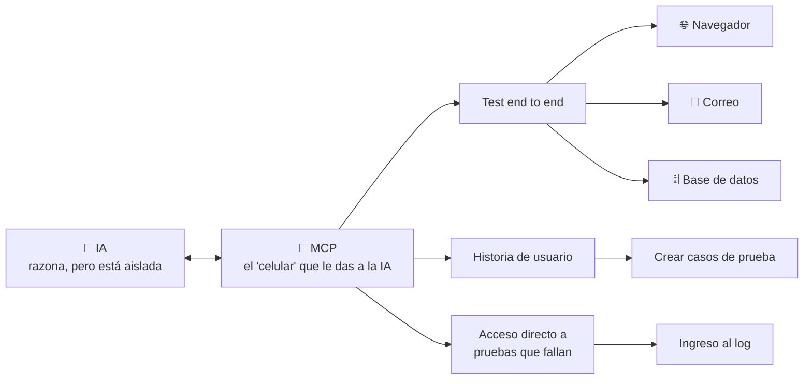

# ¿Qué es MCP? — Explicado con una analogía cotidiana

## La idea en una frase

> MCP es como darle un celular a un asistente que hasta ahora solo podía pensar, pero no podía comunicarse con nadie afuera de su oficina.

## La analogía completa

**Sin MCP:**
Imagina un asistente que trabaja en una oficina, sin ningún tipo de comunicación externa. Es muy inteligente, razona bien, resuelve problemas — pero no tiene forma de comunicarse con otra oficina. Todo su conocimiento se queda encerrado ahí adentro.

**Con MCP:**
Es como si a ese asistente le dieras un celular. Ahora puede llamar, interactuar con agentes externos, y dejar de depender únicamente de lo que ya sabe. MCP no lo hace "más inteligente" — le da **canales de comunicación** que antes no tenía.

## ¿Con qué se puede comunicar ese "asistente" (la IA) gracias a MCP?

En otras palabras: la IA sigue siendo el "cerebro", pero MCP es lo que le permite *actuar* sobre herramientas reales — abrir un navegador, revisar un correo, consultar una base de datos, o meterse directo a ver por qué falló una prueba.

## La diferencia clave con QA tradicional

| Automatización tradicional | QA con MCP |
|---|---|
| Scripts fijos, se rompen con cambios de UI | El asistente interpreta la pantalla y se adapta |
| Necesitas escribir cada paso | Describes el objetivo, el asistente ejecuta los pasos |
| Un framework por plataforma (web, mobile, API) | Un mismo "cerebro" puede usar múltiples MCPs (navegador + móvil + DB) |
| Bueno para regresión estable | Bueno para exploración, casos nuevos, triage |

## Por qué importa esta diferencia

La automatización tradicional es rígida: si cambia un botón de lugar, el test se rompe. Con MCP, el "asistente" no sigue un script ciego — interpreta lo que ve en pantalla y decide cómo actuar, de forma parecida a como lo haría una persona probando la app manualmente, pero automatizado.

---

*Diagrama original convertido a Mermaid para que se mantenga como texto versionable, no como imagen.*
