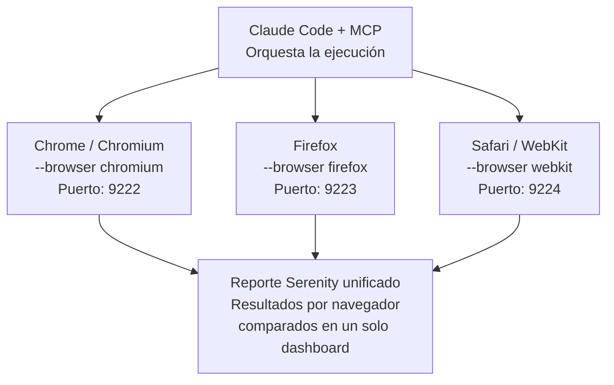

# Testing cross-browser con Claude Code + MCP

## Flujo

## Cómo funciona

1. **Claude Code + MCP** orquesta la ejecución de la misma suite de tests contra tres motores de navegador en paralelo.
2. Cada navegador corre en su propio puerto de depuración:
   - **Chrome / Chromium** — flag `--browser chromium`, puerto `9222`
   - **Firefox** — flag `--browser firefox`, puerto `9223`
   - **Safari / WebKit** — flag `--browser webkit`, puerto `9224`
3. Los resultados de los tres navegadores se consolidan en un **reporte Serenity unificado**, donde se pueden comparar resultados por navegador en un solo dashboard.

## Por qué importa
Un bug de renderizado o comportamiento puede aparecer solo en un navegador específico (típicamente Safari/WebKit, por sus diferencias de motor). Correr la misma suite en los tres en paralelo, en vez de secuencialmente, ahorra tiempo y detecta estas inconsistencias antes de que lleguen a producción.
